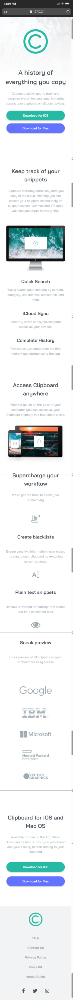

# Frontend Mentor - Clipboard landing page solution

This is a solution to the [Clipboard landing page challenge on Frontend Mentor](https://www.frontendmentor.io/challenges/clipboard-landing-page-5cc9bccd6c4c91111378ecb9). Frontend Mentor challenges help you improve your coding skills by building realistic projects. 

---

## The Challenge

Build a responsive landing page for **Clipboard**, ensuring it looks and works perfectly on both desktop and mobile devices. The design includes:  
- Hero section with call-to-action buttons  
- Features and snippets sections  
- Workflow/access section  
- Partner logos and footer  

The goal was to create a clean, responsive, and visually appealing front-end solution using modern CSS techniques.

---

## Screenshot

  

---

## Live Demo & Solution

- **Live Demo:** [live site](https://saramx-dev.github.io/Clipboard-landing-page/)  
- **Solution Repository:** [solution](https://github.com/saramx-dev/Clipboard-landing-page)  

---

## My Process

### Built With

- Semantic HTML5 markup  
- SCSS with custom properties  
- Flexbox and CSS Grid  
- Responsive design principles  

### What I Learned

- Implementing **fluid typography** for responsive headings and paragraphs  
- Using **flexbox** and **spacing utilities** to build modular, reusable layouts  
- Structuring SCSS for **scalability** and maintainability  

### Future Development

- Add **more interactive components** with JavaScript  
- Improve **accessibility and ARIA support**  
- Explore **CSS animations** for engaging user experience  

### Resources

- [Frontend Mentor](https://www.frontendmentor.io) – for design challenges  
- [MDN Web Docs](https://developer.mozilla.org/) – CSS and HTML references  

---
## 👩‍💻 Author

- **Frontend Mentor:** [@saramx-dev](https://www.frontendmentor.io/profile/saramx-dev)  
- **Twitter:** [@saramx_dev](https://x.com/saramx_dev)  
- **LinkedIn:** [Sara Mohamed](https://www.linkedin.com/in/saramx-dev/)

---

## 🙏 Acknowledgments

Big thanks to **Frontend Mentor** for providing such practical design challenges.  
They’re perfect for improving front-end development skills through hands-on projects!